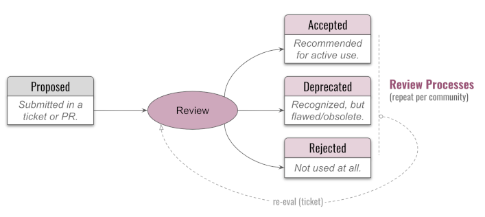

# Curation

Curation is the process of evolving your concept and term data in the direction of greater quality and richer content. Any group that uses CTWG infrastructure is encouraged to design a curation process to best achieve its goals. Curation happens in an iterative fashion, by repeated review and contribution. High-quality data is generally assigned a status like `accepted`, but it can always be reviewed, improved, and re-evaluated:

### CTWG Curation

The CTWG generally has no opinion about what constitutes "good" content for you; that is a matter for you to decide. However, the CTWG tooling works best on data that meets certain structural requirements, so we enforce a few things:

* Hyperlinks can't be broken
* Capitalization and punctuation must follow conventions
* Duplicate entries are flagged
* Tags are normalized

### Group Curation

Beyond simple rules enforced by tooling, some issues that your group might examine during its own curation include things like:

* Are we choosing a word or phrase that has a different meaning to others -- and that therefore would be prone to misunderstanding?
* Do we have a crisp, terse definition?
* Have we identified the defining characteristics of a concept, such that we can say with confidence whether X is or is not an example?
* Have we provided usage exmaples?
* Have we cited sources?
* Would diagrams help?
* Do we need to check alignment with experts from other disciplines?
* Are there terms that should be deprecated because our mental models or language preferences have changed?

Matters like these are debated in github issues.